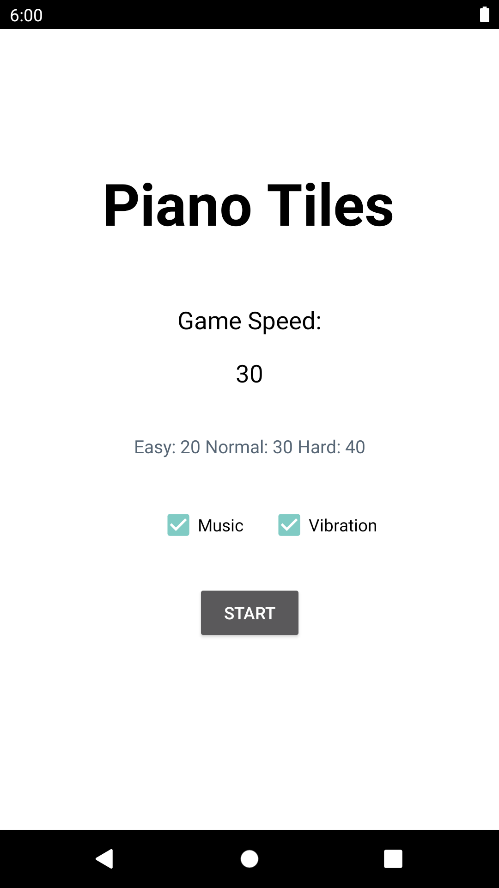
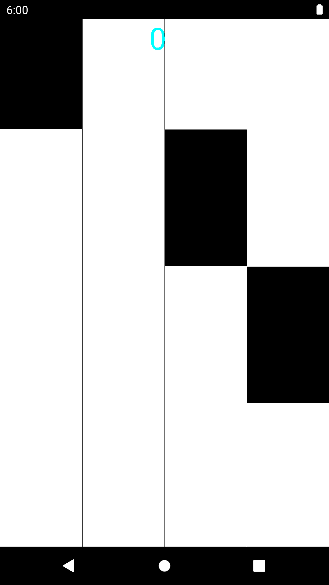
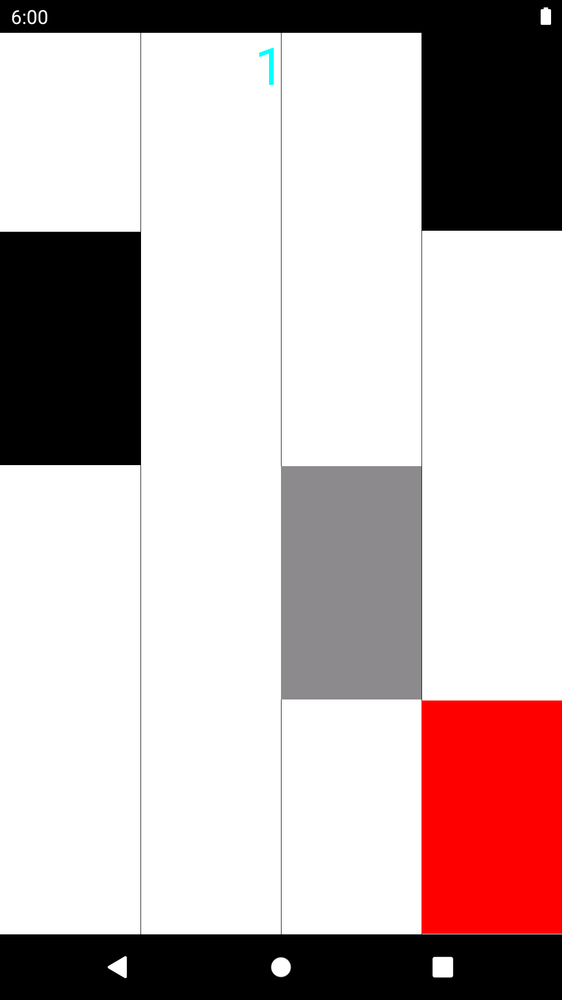
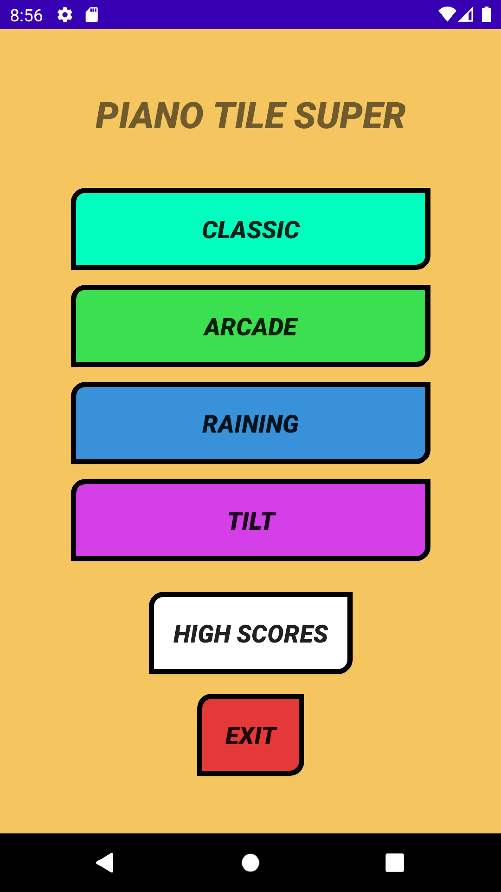
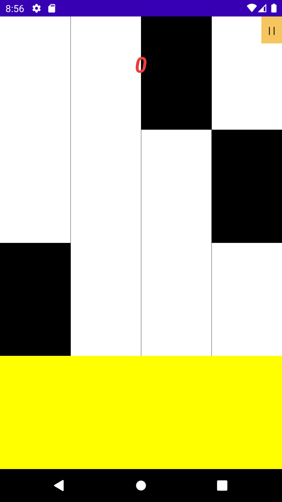
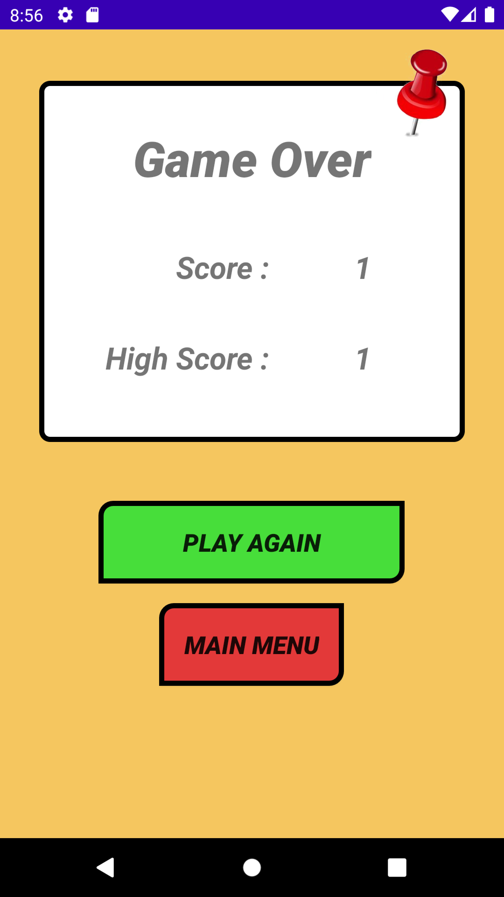
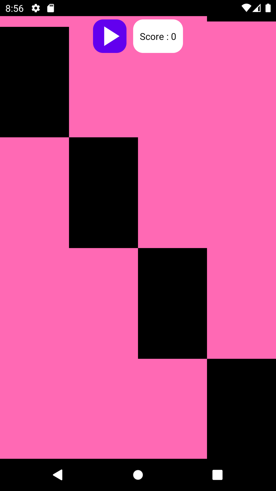
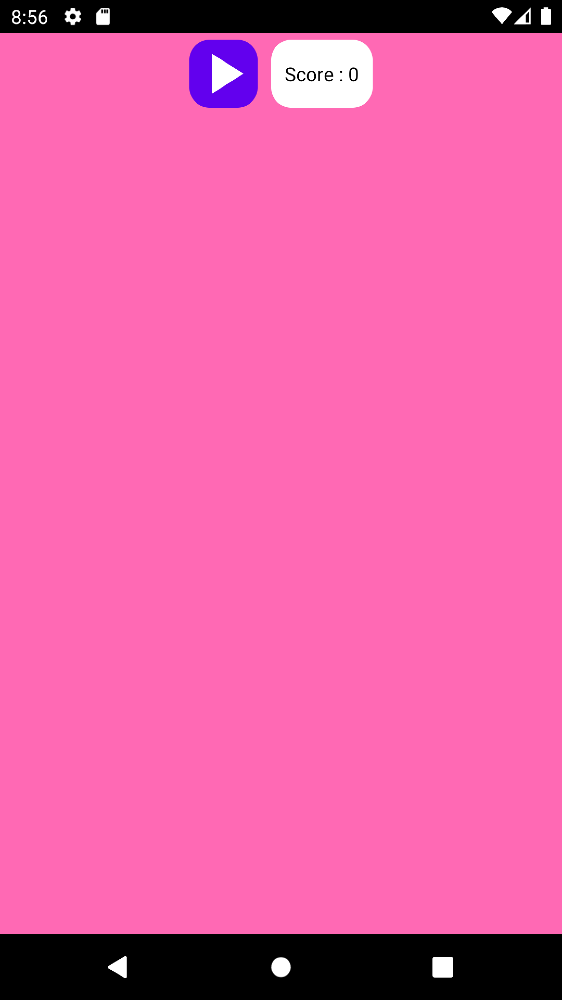
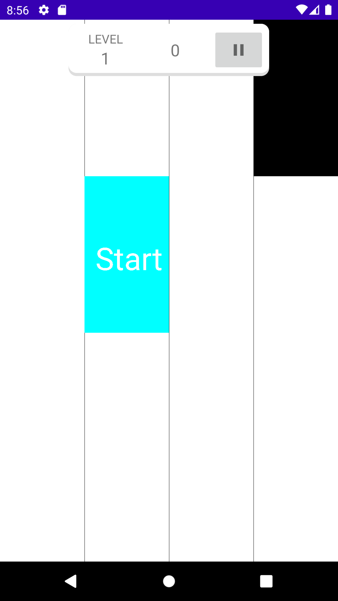
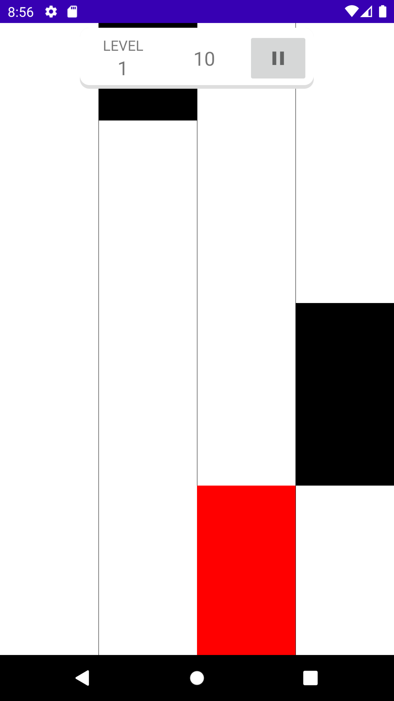

## piano-tiles-clone
Clone project piano tiles android studio from github open sources

## Version Release
This Is Latest Release

    $version_release = development

What's New??

    * Development *

## Screen Shoot [Mihai-Maxim-Fii](https://github.com/Mihai-Maxim-Fii)

<table>
    <tr>
        <th>UI 1</th>
        <th>UI 2</th>
        <th>UI 3</th>
    </tr>
    <tr>
        <td></td>
        <td></td>
        <td></td>
    </tr>
</table>

## Screen Shoot [Gian Martin](https://github.com/gianmartind)

<table>
    <tr>
        <th>UI 1</th>
        <th>UI 2</th>
        <th>UI 3</th>
    </tr>
    <tr>
        <td></td>
        <td></td>
        <td></td>
    </tr>
</table>

## Screen Shoot [Attila](https://github.com/atillaturkmen)
<table>
    <tr>
        <th>UI 1</th>
        <th>UI 2</th>
        <th>UI 3</th>
    </tr>
    <tr>
        <td></td>
        <td></td>
        <td></td>
    </tr>
</table>

## Screen Shoot [Jiang Han](https://github.com/jghjianghan)
<table>
    <tr>
        <th>UI 1</th>
        <th>UI 2</th>
        <th>UI 3</th>
    </tr>
    <tr>
        <td></td>
        <td></td>
        <td></td>
    </tr>
</table>

## Screen Shoot [Obed Kristiaji](https://github.com/obedkristiaji)
<table>
    <tr>
        <th>UI 1</th>
        <th>UI 2</th>
        <th>UI 3</th>
    </tr>
    <tr>
        <td></td>
        <td></td>
        <td></td>
    </tr>
</table>

## Screen Shoot [frostygum](https://github.com/frostygum)
<table>
    <tr>
        <th>UI 1</th>
        <th>UI 2</th>
        <th>UI 3</th>
    </tr>
    <tr>
        <td></td>
        <td></td>
        <td></td>
    </tr>
</table>

## Colaborator
Very open to anyone, I'll write your name under this, please contribute by sending an email to me

- Mail To faisalamircs@gmail.com
- Subject : Github _ [Github-Username-Account] _ [Language] _ [Repository-Name]
- Example : Github_amirisback_kotlin_admob-helper-implementation

Name Of Contribute
- Muhammad Faisal Amir
- Waiting List
- Waiting List

Waiting for your contribute

## Inspiration

<table>
    <tr>
        <th>No.</th>
        <th>Creator</th>
        <th>Project Name</th>
    </tr>
    <tr>
        <td>1.</td>
        <td><a href="https://github.com/Mihai-Maxim-Fii">Mihai-Maxim-Fii</a></td>
        <td><a href="https://github.com/Mihai-Maxim-Fii/White-Tiles-Android">White-Tiles-Android</a></td>
    </tr>
    <tr>
        <td>2.</td>
        <td><a href="https://github.com/gianmartind">Gian Martin</a></td>
        <td><a href="https://github.com/gianmartind/PianoTiles">PianoTiles</a></td>
    </tr>
    <tr>
        <td>3.</td>
        <td><a href="https://github.com/atillaturkmen">Atilla</a></td>
        <td><a href="https://github.com/atillaturkmen/piano-tiles">piano-tiles</a></td>
    </tr>
    <tr>
        <td>4.</td>
        <td><a href="https://github.com/jghjianghan">Jiang Han</a></td>
        <td><a href="https://github.com/jghjianghan/Piano_Tiles_KW">Piano_Tiles_KW</a></td>
    </tr>
    <tr>
        <td>5.</td>
        <td><a href="https://github.com/obedkristiaji">Obed Kristiaji</a></td>
        <td><a href="https://github.com/obedkristiaji/Piano-Tiles">Piano-Tiles</a></td>
    </tr>
    <tr>
        <td>6.</td>
        <td><a href="https://github.com/frostygum">frostygum</a></td>
        <td><a href="https://github.com/frostygum/TUBES-PianoTiles">TUBES-PianoTiles</a></td>
    </tr>

</table>

## Attention !!!
- Please enjoy and don't forget fork and give a star
- Don't Forget Follow My Github Account

