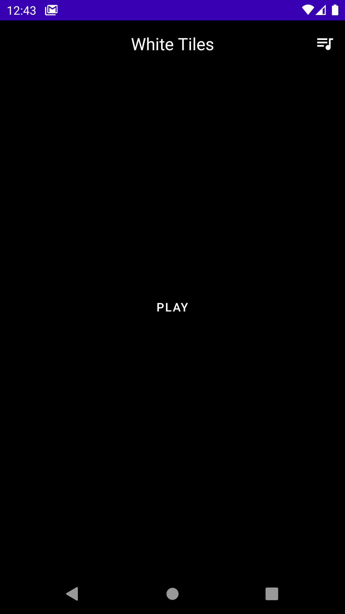
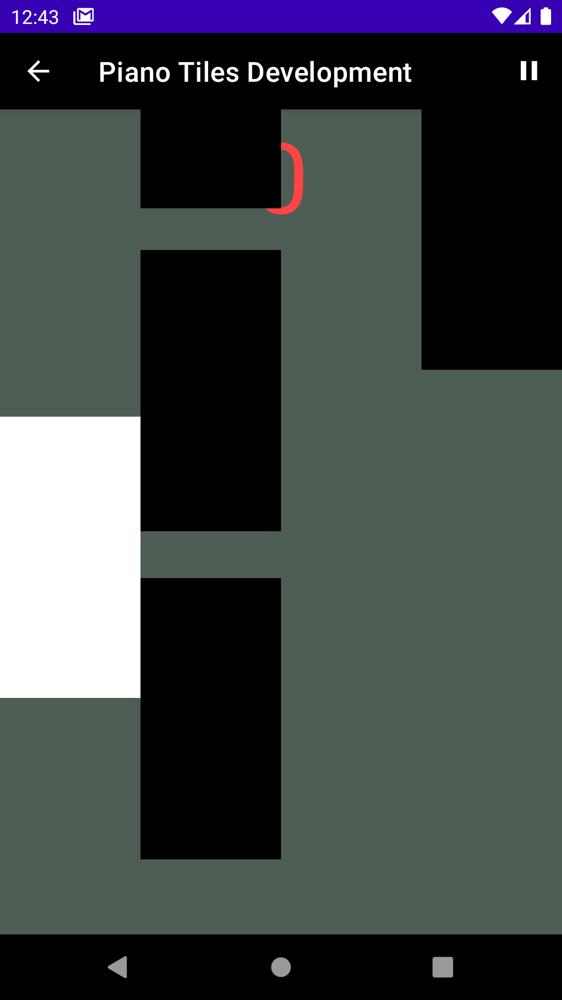
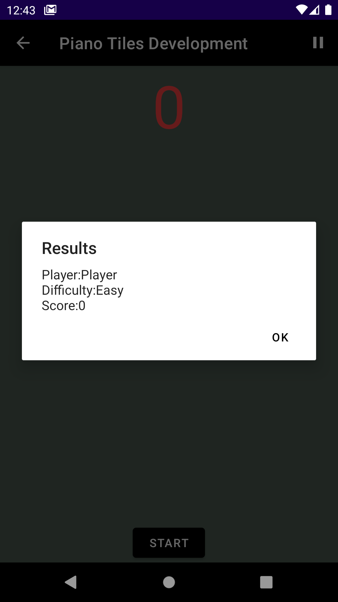
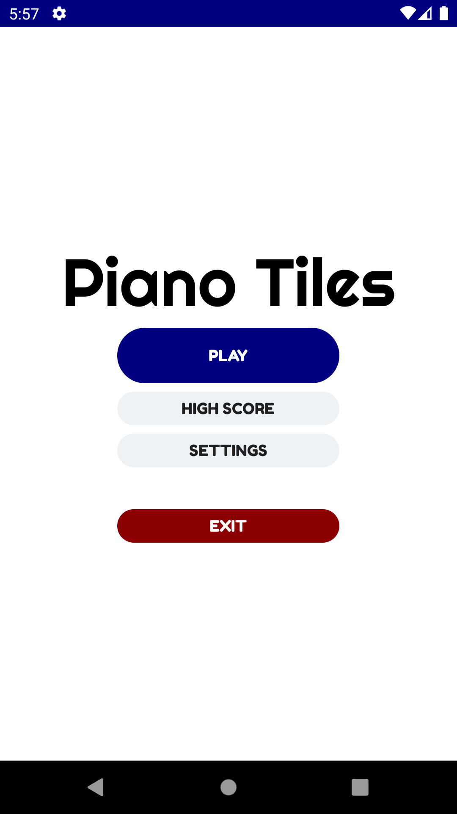
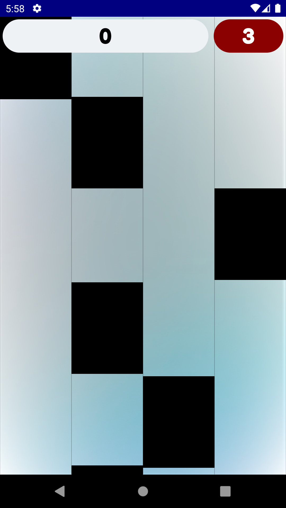
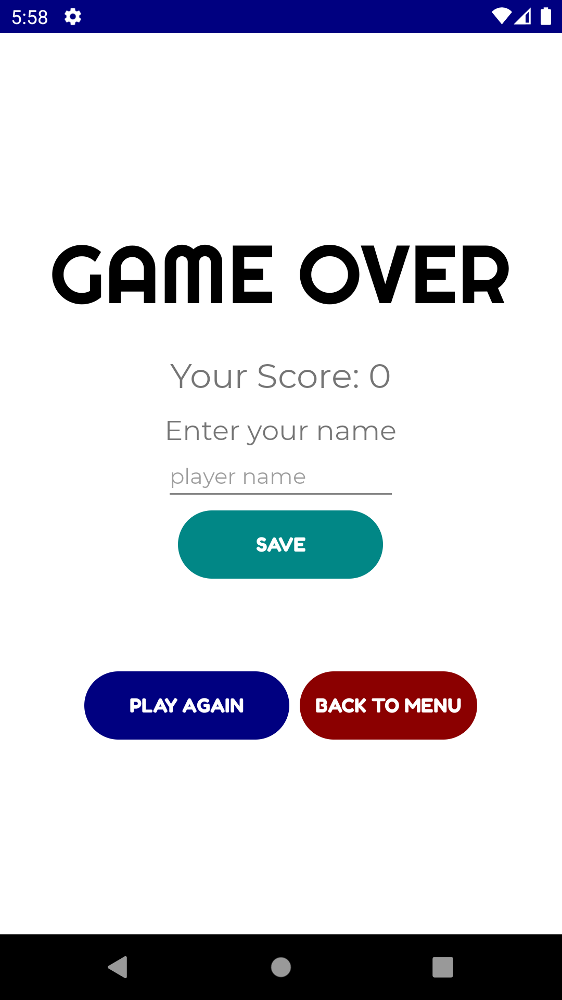

## piano-tiles-clone
Clone project piano tiles android studio from github open sources

## Version Release
This Is Latest Release

    $version_release = development

What's New??

    * Development *

## Screen Shoot [Mihai-Maxim-Fii](https://github.com/Mihai-Maxim-Fii)
| UI 1 | UI 2 | UI 3 |
|:----:|:----:|:----:|
| |  |  |

## Screen Shoot [Gian Martin](https://github.com/gianmartind)
| UI 1 | UI 2 | UI 3 |
|:----:|:----:|:----:|
| |  |  |

## Colaborator
Very open to anyone, I'll write your name under this, please contribute by sending an email to me

- Mail To faisalamircs@gmail.com
- Subject : Github _ [Github-Username-Account] _ [Language] _ [Repository-Name]
- Example : Github_amirisback_kotlin_admob-helper-implementation

Name Of Contribute
- Muhammad Faisal Amir
- Waiting List
- Waiting List

Waiting for your contribute

## Inspiration
- Creator [Mihai-Maxim-Fii](https://github.com/Mihai-Maxim-Fii) >> White-Tiles-Android [Source](https://github.com/Mihai-Maxim-Fii/White-Tiles-Android) - [Video](https://www.youtube.com/watch?v=9-FNDK0K0A4&ab_channel=MihaiMaxim)
- Creator [Gian Martin](https://github.com/gianmartind) >> PianoTiles [Source](https://github.com/gianmartind/PianoTiles)

## Attention !!!
- Please enjoy and don't forget fork and give a star
- Don't Forget Follow My Github Account

